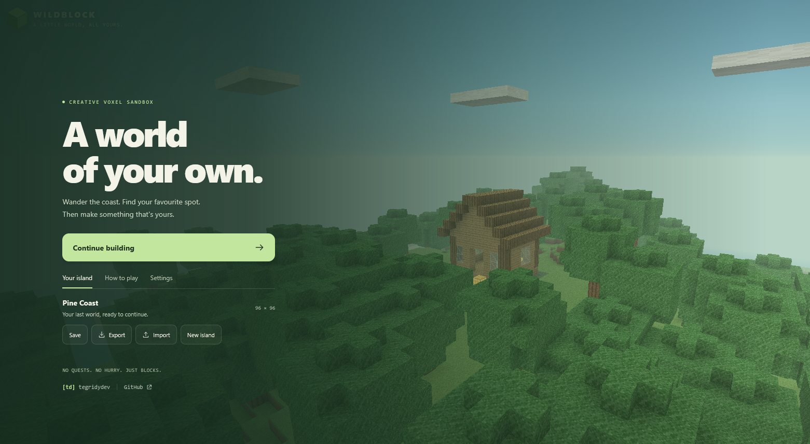
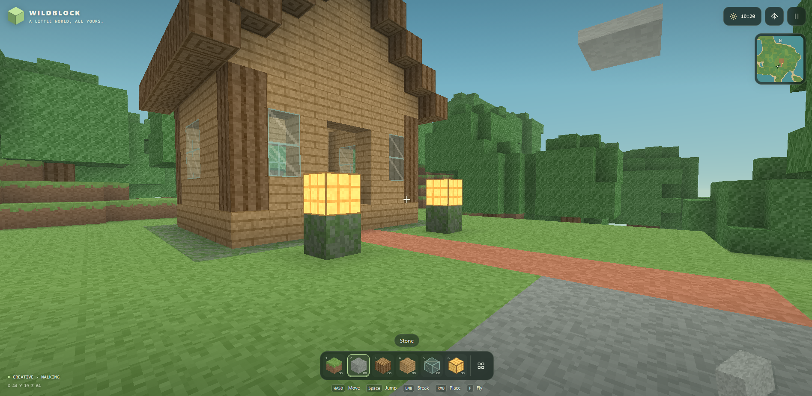
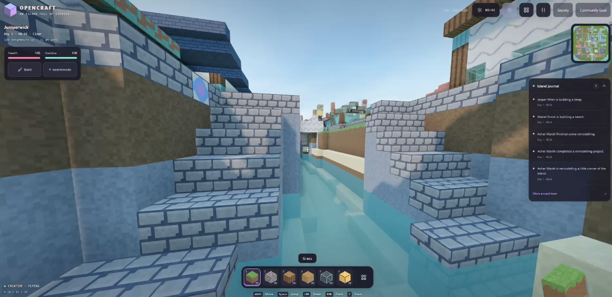
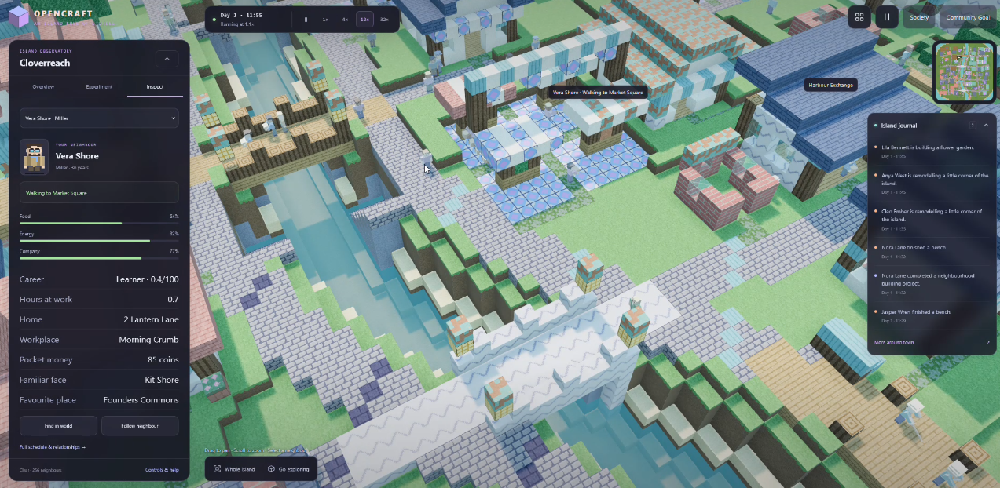

+++
title = "minecraft time with astra"
date = "2026"
description = "Trying Astra on a Minecraft-style browser game, with successive screenshots, playable prototypes and notes on what changed."
draft = false
id = "blog/minecraft-time-with-astra"
type = "article"
author = "tegridydev"
topic = "agent-systems"
related = []
image = "/blog/agents/minecraft-time-with-astra/wild-block-one-shot.png"
image_alt = "Screenshot of the first Wild Block browser-game prototype."
+++

# [td] tegridydev | minecraft time with astra

Spent some time playing around with Astra during the last few days and gave it my usual Minecraft test. I know these oneshot game clones have been benchmarked to death, but I still find them useful and by now I've spent enough (wasted? lol) time making little voxel games with different models to have a feel for where they struggle and how much revision I'm likely to be doing.

tbh I usually get a bit carried away with these. I'll start with a basic game and keep wanting to expand the world, give the NPCs more to do and make everything feel nicer to use. It's a pretty conveniently lazy way to try a bunch of things together and see how well the model keeps up as the project grows.

This run started in **Work with Astra on Max**, using this exact prompt:

> Please output a complete single file index.html custom modern mobile responsive Minecraft voxel game

The first output came back as a little game called Wildblock, contained in one HTML file.

I was pretty happy with how much it included within a single output and it felt smooth/optimised straight out of the box (usually that requires a few revision passes focussing on performance and stability).

Even the menu already had world saving, import/export, seeds and settings for graphics and controls. Those are details I appreciate when I'm sitting there playing with something, particularly when I haven't had to spend another 10 minutes going back and forward planning those additions and features.

Here is that same project at a couple of later points.

## the original oneshot plus one revision with Astra Work Max

I liked where that revision had taken it (adding NPCs, buildings, lighting, water physics, community sim game systems etc)

So I grabbed that revised single HTML file and decided to keep going with the simulation side and build it out.

## the topdown full scale world sim version

I opened that revised output in my local Zed environment and used Codex CLI. That stage consisted of one full `/plan` run with **Astra xHigh**, followed by one `/goal` revision with **Astra Low**.

The whole process took roughly **145 minutes**, from the initial prompt through to the completed Codex result, so roughly 2 hours 25 minutes (I did not speedrun this lol).

Getting to a similar level of quality and feature depth with **Sol 5.6** had taken me around **3–5 hours**, including multiple Codex revision runs using xHigh for planning and Medium for coding.

These are rough timings from my own sessions, and I'm judging the results against what I personally wanted from the game. Still, the difference was noticeable and the overall "development" experience was chill af.

I'm particularly interested in spending more time with that xHigh/Low combination. Getting this result with Low handling the Codex implementation gives me a reason to keep trying it. I'd like to see how it holds up through further revisions, especially once there are more systems interacting and more opportunities to accidentally break something elsewhere.

The top-down version is probably where I'll lose more time now. I like the idea of leaving a little world running and watching what the NPCs do with it. I'm curious how far I could take the settlements and how well everything would hold together over a longer session.

I've shared the oneshot Wildblock source here as [wildblock.html](wildblock.html).

That copy has a small branding pass for my `[td]` metadata and menu links; it's the initial oneshot game, before either of the gameplay revisions shown in the screenshots.

## about the files

The playable file and all four screenshots live here with this post. The screenshots show different stages; opening the HTML gives you the initial oneshot, not the later top-down simulation. Open it in a browser with WebGL support. Its local save belongs to the browser/origin you use, so export a world if you want a portable copy.

[Blog index](../../README.md)
